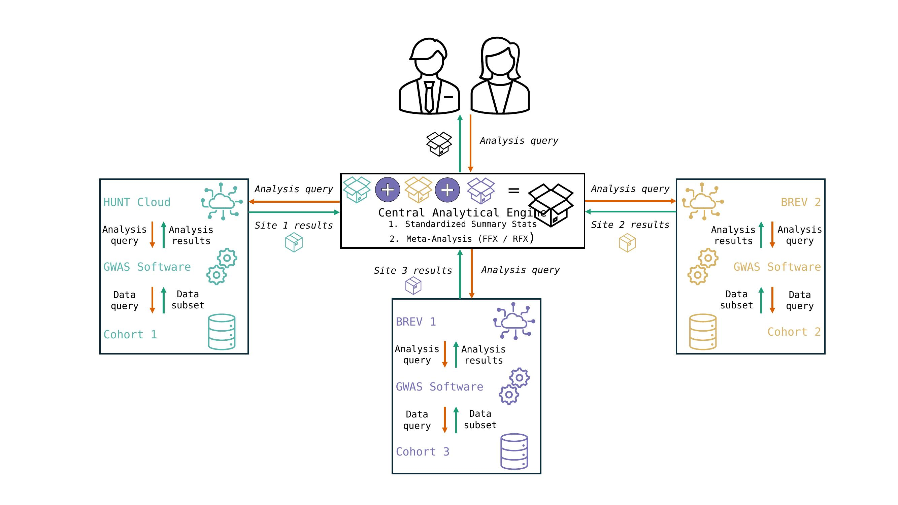

# FedGX: Federated GWAS analyses across biobanks

Using available code from FedGen. 
https://github.com/collaborativebioinformatics/FedGen

# Plan
  
 
# Team members
* Allan Lind-Thomsen
* Xiaoping Wu
* Marlene Rietz [writer]
* Moh
* Pravesh Parekh
* with inputs from Anders Dale
